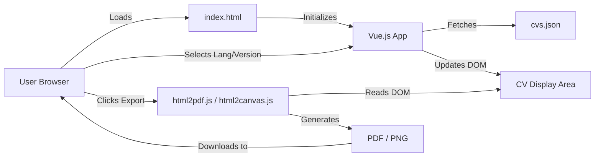

# System Patterns

## System Architecture

- **Client-Side Single Page Application (SPA)**: The application is entirely client-side, running in the user's browser.
- **Static Site**: Consists of HTML, CSS, JavaScript, and a JSON data file. It can be hosted on any static web hosting service or served locally with a simple HTTP server like `http-server`.
- **Data Flow**:
    1. `index.html` is loaded.
    2. Vue.js 3 application initializes.
    3. The Vue app fetches CV data from `cvs.json`.
    4. User selects language and version.
    5. Vue app filters and displays the relevant CV data.
    6. Export functions (`html2pdf.js`, `html2canvas.js`) process the `#cv-content` DOM element to generate PDF/image.

## Key Technical Decisions

- **Vue.js 3**: Chosen for its reactivity, component-based architecture, and ease of use for building dynamic user interfaces. The Composition API or Options API can be used (current `index.html` uses Options API).
- **Tailwind CSS**: Used for utility-first CSS styling, allowing for rapid UI development and customization. It's included via CDN.
- **`cvs.json` for Data**: Centralizes all CV data, making it easier to manage and update content for multiple languages and versions without altering the core application logic.
- **`html2pdf.js` and `html2canvas.js`**: Selected for client-side PDF and image generation, avoiding server-side processing dependencies.
- **Import Maps**: Used in `index.html` to manage JavaScript module imports (Vue from CDN, `cvs.json` locally). This simplifies module loading without a build step for this simple project.
- **JSON-LD for SEO**: Implemented to provide structured data to search engines, enhancing the CV's discoverability and representation in search results.

## Design Patterns in Use

- **Component-Based Architecture (Vue.js)**: The UI is implicitly structured around components, although `index.html` contains a single large Vue app instance. Future refactoring could break this down into smaller, reusable Vue components (e.g., for sections like Experience, Education, Skills).
- **Data-Driven Views**: The UI dynamically renders based on the data fetched from `cvs.json` and the user's selections.
- **Observer Pattern (Vue.js Reactivity)**: Vue's reactivity system automatically updates the DOM when underlying data changes (e.g., `selectedLanguage`, `cvData`).
- **Strategy Pattern (Implicit for CV versions/languages)**: The `filterCVs` method effectively applies a strategy to select and display the correct CV data based on language and version criteria.

## Component Relationships

- **`App` (Main Vue Instance)**:
    - Manages state: `cvs` (all CVs), `selectedLanguage`, `selectedVersion`, `cvData` (current CV), `labels`.
    - Handles methods: `fetchCVs`, `filterCVs`, `updateLabels`, `updateJSONLD`, `exportPDF`, `exportImage`, `populateAvailableVersions`.
    - Interacts with DOM elements: `#app` (mount point), `#cv-content` (for export), language/version select dropdowns.
- **`cvs.json`**: Data source, an array of CV objects.
- **`index.html`**: Contains the HTML structure, Vue app template, styles, and script includes.
- **External Libraries**:
    - `Vue.js`: Core rendering and reactivity.
    - `Tailwind CSS`: Styling.
    - `html2pdf.js`: PDF generation.
    - `html2canvas.js`: Image generation.
    - `Font Awesome`: Icons.
    - `Google Fonts`: Typography.

## Critical Implementation Paths

- **Data Fetching and Filtering (`fetchCVs`, `filterCVs`, `populateAvailableVersions`)**: Core logic for loading and displaying the correct CV. Robust error handling for `fetch` is important. The current implementation fetches `cvs.json` with a timestamp to bypass browser cache, which is a simple approach.
- **PDF/Image Export (`exportPDF`, `exportImage`)**: Relies on external libraries correctly interpreting the DOM of `#cv-content`. Styling and layout complexities can sometimes affect export quality. The use of `scale: 3` in `html2canvas` options suggests an attempt to improve resolution.
- **Reactivity and State Management (Vue.js)**: Ensuring that changes to `selectedLanguage` or `selectedVersion` correctly trigger updates to `cvData`, `labels`, `availableVersions`, and the JSON-LD script. Vue's `watch` and `computed` properties are used for this.
- **JSON-LD Generation (`updateJSONLD`)**: Dynamically creating and updating the structured data script based on the current `cvData`.
